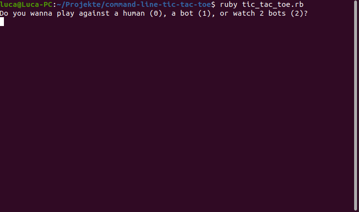
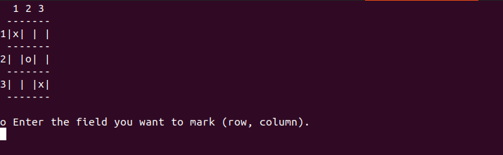

# commandline tic-tac-toe
## Description
A tic-tac-toe game you can play in the commandline, written in ruby.
## Gamemodes
1. Player vs Player  
2. Player vs Bot  
3. Bot vs Bot 
## Demo

## Screenshots

